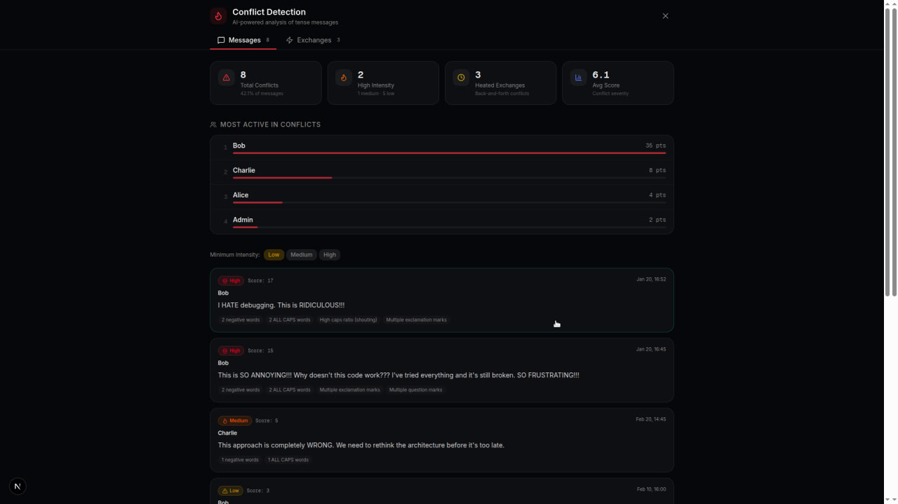

# Telesight

A beautiful, interactive visualization tool for Telegram channel, group, and DM exports. Analyze your conversations with AI-powered insights, analytics, and media galleries — all running client-side in your browser.



## Features

### Core Features
- 📊 **Analytics Dashboard** — Message statistics, reactions, engagement metrics
- 🖼️ **Media Gallery** — Grid view of all photos and videos with lightbox
- 🔗 **Link Previews** — Automatic preview cards for shared URLs
- 📅 **Calendar View** — Monthly heatmap of message activity
- 🔍 **Search & Filter** — Full-text search with filters for links, reactions, forwards
- #️⃣ **Hashtag Support** — Click hashtags to filter related messages
- 📈 **Reply Graph** — Visualize conversation threads and reply chains
- 💡 **Insights** — "Wrapped" style yearly summaries

### AI-Powered Features
- 🔥 **Conflict Detection** — Identify negative sentiment and heated exchanges
  - Detects frustration, anger, and conflicts in messages
  - Groups consecutive negative messages into "heated exchanges"
  - Intensity scoring: Low / Medium / High
  - Shows top contributors to conflicts (for groups)
  - Runs entirely client-side — no data leaves your browser

## Quick Start

### 1. Export Your Telegram Data

**From Telegram Desktop:**
1. Open the chat you want to export (channel, group, or DM)
2. Click the **three dots menu (⋮)** → **Export chat history**
3. Select **JSON** format
4. Choose what to include (messages, photos, videos, etc.)
5. Export and save the folder

**Note:** For account-wide exports, use "Export Telegram Data" in Settings → Advanced, but you'll need to extract individual chats.

### 2. Run Telesight

```bash
# Clone the repository
git clone https://github.com/dagmawibabi/telesight.git
cd telesight

# Install dependencies
npm install

# Start development server
npm run dev
```

### 3. Import Your Export

1. Open `http://localhost:3000`
2. Click **"Select your export folder"**
3. Choose the folder with your `result.json` and media files
4. Explore your data!

## Usage Guide

### Navigation
- **Messages** — Infinite scroll masonry grid with month separators
- **Search** — Filter messages by text, sender, or type
- **Filters** — Show only: links, reactions, forwarded, replies, service messages
- **Sort** — Newest first or oldest first

### Viewer Types

**Channel Viewer**
- Optimized for public/private channels
- Analytics, reply graphs, media gallery
- Calendar heatmap for activity patterns

**Group Viewer**
- Member analytics and interaction maps
- Topic extraction and threaded view
- Conflict detection for heated discussions

**DM Viewer**
- Chat bubble interface
- Participant color coding
- Threaded conversation view

### AI Conflict Detection

Click the 🔥 **Conflicts** button in any viewer to:
- See messages with negative sentiment
- Identify heated back-and-forth exchanges
- Filter by intensity level (Low/Medium/High)
- Navigate to specific messages
- View conflict statistics and top contributors

**What it detects:**
- Negative keywords (hate, stupid, wrong, frustrating, etc.)
- Shouting (ALL CAPS words, high caps ratio)
- Frustration patterns (multiple `!!!` or `???`)
- Negation + negative word combos
- Short angry responses

## Tech Stack

- **Framework:** Next.js 16 + React 19
- **Styling:** Tailwind CSS v4
- **UI Components:** Radix UI primitives
- **Charts:** Recharts
- **Icons:** Lucide React
- **Date Handling:** date-fns

## Project Structure

```
telesight/
├── app/                    # Next.js app router
├── components/
│   ├── channel-viewer.tsx  # Channel export viewer
│   ├── group-viewer.tsx    # Group export viewer
│   ├── dm-viewer.tsx       # DM export viewer
│   ├── conflict-view.tsx   # 🔥 AI conflict detection overlay
│   ├── stats-view.tsx      # Analytics dashboard
│   ├── message-card.tsx    # Individual message rendering
│   └── ...
├── lib/
│   ├── telegram-types.ts   # TypeScript types for exports
│   ├── conflict-detector.ts # 🔥 Conflict detection engine
│   ├── analytics.ts        # Statistics computation
│   └── ...
├── hooks/
│   └── use-media-url.ts    # Media file URL handling
└── public/                 # Static assets
```

## Privacy

Telesight runs entirely in your browser:
- ✅ No data sent to any server
- ✅ No API keys required
- ✅ No tracking or analytics
- ✅ Your Telegram exports stay on your computer

The only network requests are for:
- Loading the app files
- Fetching link previews (optional, via `/api/link-preview`)

## Contributing

We welcome contributions! Here's how:

1. Fork the repository
2. Create a feature branch: `git checkout -b feature/amazing-feature`
3. Make your changes
4. Commit: `git commit -m 'feat: add amazing feature'`
5. Push: `git push origin feature/amazing-feature`
6. Open a Pull Request

### Ideas for Contributions
- [ ] Smart semantic search with embeddings
- [ ] Auto-generated topic extraction
- [ ] Sentiment timeline visualization
- [ ] Export filtered results to CSV/JSON
- [ ] Support for Telegram HTML exports
- [ ] Multi-export comparison view
- [ ] Keyboard shortcuts and accessibility

## Development

```bash
# Install dependencies
npm install

# Run development server
npm run dev

# Build for production
npm run build

# Lint code
npm run lint
```

## License

MIT License — feel free to use, modify, and distribute!

## Credits

Created by [dagmawibabi](https://github.com/dagmawibabi)

Contributors:
- [sileshidev-lab](https://github.com/sileshidev-lab) — AI conflict detection feature

---

**Telesight** — *See your Telegram data in a whole new light* 🔦
